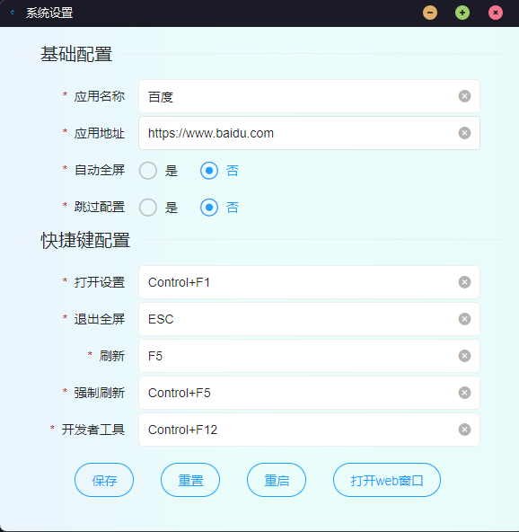
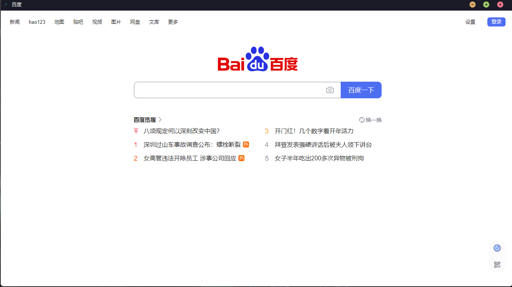

### webDeskTop

快速将web地址转换成桌面应用

- 技术栈：electron，electron-forge，layui
- 功能点：
  - 配置窗体
  - web嵌入窗体

### 功能预览



### 本地开发
#### 设置国内镜像源(加速)
```
npm config set registry=https://registry.npmmirror.com
npm config set disturl=https://registry.npmmirror.com/-/binary/node
npm config set electron_mirror=https://registry.npmmirror.com/-/binary/electron/
```

#### 安装依赖
```
npm install
```

#### 启动
```
npm run start
```

#### 打包
```
npm run package
npm run make
```

#### 初始化electron
```
npm install --save-dev electron
npm i -g @electron-forge/cli
electron-forge import
控制台中文乱码需要设置script：chcp 65001 &&
```

#### 安装asar（源代码加密）
```
npm install -D asar
```